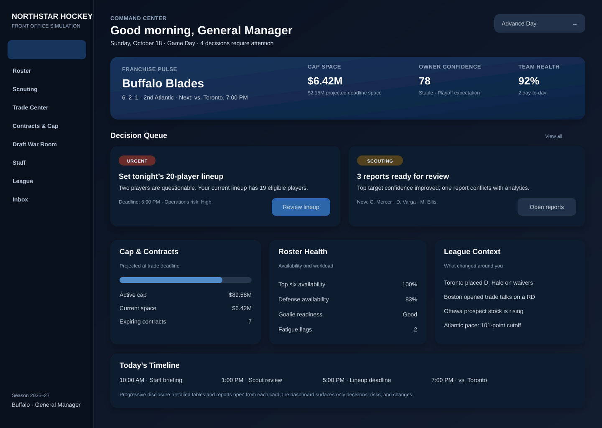

# Main Dashboard Direction v1 — UI Review Pending

## Purpose

Define a premium, decision-first command center for the controlled franchise. This is a Stage 1 direction artifact, not an implementation approval.

## Specialist deliverables

### NHL Operations — game-day roster compliance alert

**Requirement:** The dashboard must surface an actionable lineup-compliance warning whenever the proposed game roster is below the applicable dressed-player minimum or otherwise fails the active season ruleset. The warning must identify the deadline, affected roster state, and a direct path to correct the lineup. The UI must read the versioned rules registry rather than hard-code a season-independent number.

**Acceptance criteria**

1. The alert is generated from the save's active ruleset.
2. It distinguishes active-roster limits from game-lineup requirements.
3. Injured/reserve status and season exceptions are evaluated before declaring noncompliance.
4. The user can open the exact roster state causing the warning.
5. The simulation cannot silently advance through a mandatory unresolved lineup decision.

This avoids presenting a generic `23-player roster` number as though it were the same as the dressed game roster and keeps the UI compatible with future CBA/rules changes.

### Competing Games — clean-room pattern translation

**Observed pattern:** Deep management games let players delegate broad operational areas while retaining control over high-value decisions. They also provide strong mode-level context, but dense menus can create a steep learning curve.

**Original requirement:** Add a decision-first command center that summarizes only material changes, deadlines, risks, and recommended actions. Detailed data remains one click away in specialist workspaces. Each card must answer: what changed, why it matters, when action is due, and where to act.

**Differentiation:** Rather than reproducing another game's menu structure, Northstar uses an explainable front-office operating rhythm: decision queue, franchise pulse, today's timeline, and contextual intelligence. Delegation settings will later control which cards appear and which actions can be auto-resolved.

### Coding — bounded artifact

Added a dependency-free SVG dashboard wireframe and this implementation specification on `agent/ui-dashboard-approval-v1`. No production behavior or existing UI code is changed. The branch is intentionally reversible and stacked on the current scouting-intelligence draft.

### Testing — design validation checklist

Status: **Specification pass; implementation not yet testable.**

Validate the implemented screen against:

- 1280×720, 1440×900, 1920×1080 desktop layouts without clipped primary actions;
- 390×844 mobile layout with intentional card reordering rather than scaled-down desktop columns;
- keyboard traversal in visual order, visible focus indicators, and no focus traps;
- 200% text zoom without loss of decisions or deadlines;
- status meaning conveyed by text/icon in addition to color;
- dense state with at least six decisions and long team/player names;
- empty state, offline state, loading state, and API error state;
- lineup alert linked to the exact corrective screen;
- screen-reader labels for metrics, progress indicators, and urgency;
- no hidden horizontal scrolling for primary dashboard content.

### UI/UX Design — information hierarchy

The proposed hierarchy is:

1. **Orientation:** date, game-day state, controlled team, and advance-day action.
2. **Franchise pulse:** record, standings, next game, cap, owner confidence, and health.
3. **Decision queue:** urgent or high-value work requiring the GM's judgment.
4. **Functional summaries:** cap/contracts, roster health, scouting, and league context.
5. **Timeline:** operating cadence and upcoming deadlines.

Progressive disclosure keeps tables, dossiers, and historical detail inside their dedicated workspaces. The dashboard remains a command center rather than a data warehouse.

## Visual direction

- Dark navy foundation with restrained blue accents and high-contrast neutral typography.
- Large type and stronger contrast only for decisions and primary metrics.
- Consistent 8-point spacing system and 16–18 px card radii.
- Minimal hockey decoration; product identity comes from language, data, and operational rhythm.
- Cards use short summaries and one primary action. Secondary detail opens contextually.
- Urgency is indicated by label, icon/state, and color—not color alone.

## Responsive intent

Desktop uses a persistent left navigation and a two-column decision queue. Mobile replaces the rail with bottom navigation, places the decision queue immediately after the compact franchise pulse, and converts secondary summaries into horizontally paged or collapsible sections. The advance-day action remains visible but cannot obscure unresolved mandatory decisions.

## Approval request

**Stage 1 — Direction Wireframe**

Kyle: choose one response for this direction:

- **Approve** — proceed to a polished visual mockup with realistic dense and error states.
- **Request changes** — identify the elements to revise.
- **Request alternate concept** — produce a materially different dashboard direction before implementation.

No broad dashboard implementation should begin until Stage 1 is approved.