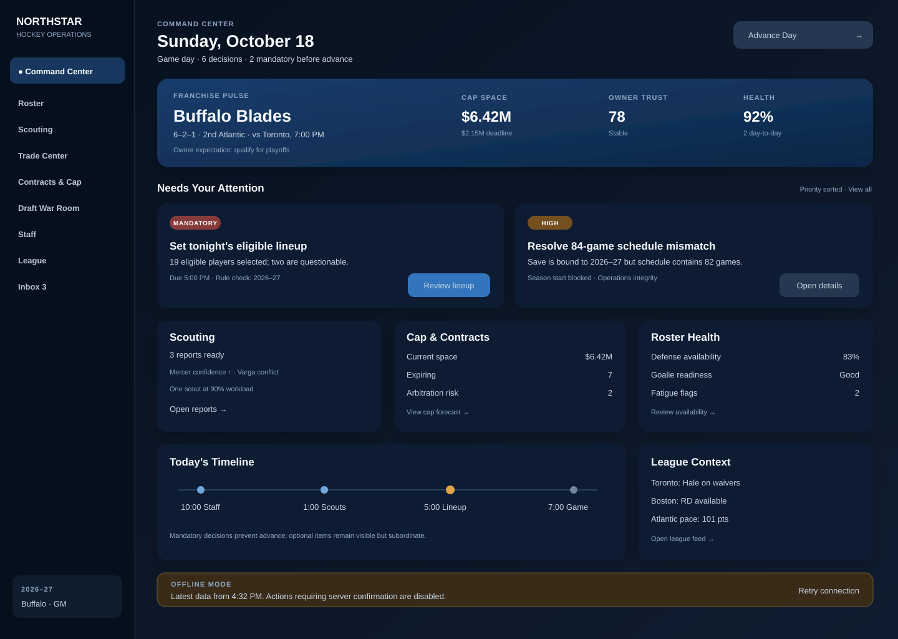
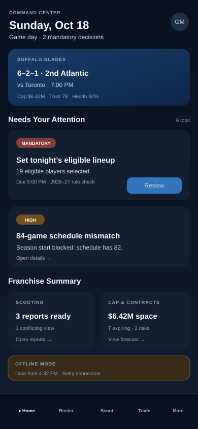

# Main Command Center — Stage 2 UI Review Pending

## Approval state

Kyle approved the alternate Stage 1 direction on July 12, 2026. The approved direction is a decision-first command center with a premium dark hockey-operations visual language, desktop navigation rail, mobile bottom navigation, franchise pulse, and a prominent `Needs Your Attention` queue.

This document now governs the Stage 2 polished mockup review. Broad production implementation remains blocked until Kyle approves this polished direction.

## Stage 2 previews

### Desktop — realistic dense and non-ideal state

### Mobile — intentionally reordered decision-first state

## Cycle specialist deliverables

### NHL Operations — 2026–27 schedule integrity gate

**Verified requirement:** A save bound to the 2026–27 ruleset must not begin or continue a regular season unless its generated schedule matches the season-defined game count. For 2026–27, the schedule must contain 84 games per team rather than inheriting the Alpha's 82-game assumption.

**Acceptance criteria**

1. The schedule generator reads `regular_season_games` from the active immutable ruleset.
2. Season initialization fails with an actionable integrity error when any team has a different game total.
3. Home/road and standings reconciliation tests use the ruleset value rather than a hard-coded 82.
4. Existing 82-game prototype saves remain explicitly labeled as legacy Alpha saves and are never silently presented as 2026–27-compliant.
5. The dashboard surfaces the mismatch as a mandatory decision and prevents season advancement until the save is repaired or reset.

**Authority note:** The NHL and NHLPA ratified a CBA extension in July 2025 that expands the regular season to 84 games beginning in 2026–27. Implementation must preserve source provenance in the rules registry.

### Competing Games — contextual comparison drawer

**Observed clean-room pattern:** Strong management simulations keep the primary workspace focused while allowing the user to compare alternatives without losing context. Weak implementations force repeated navigation between a list, a profile, and a transaction screen.

**Original product requirement:** Selecting a player, contract, scouting report, or decision card opens a reusable contextual comparison drawer. The drawer shows no more than three user-selected comparators, highlights material differences, preserves uncertainty ranges, and keeps the originating decision visible.

**Differentiation and implementation notes**

- Use the same drawer contract across roster, scouting, trade, contract, and draft workflows.
- Show only decision-relevant fields by default; advanced data remains behind categorized tabs.
- Preserve scouting uncertainty rather than exposing hidden true ratings.
- Keyboard focus moves into the drawer and returns to the invoking control on close.
- Mobile uses a full-height sheet with a sticky decision summary instead of a squeezed side panel.

No proprietary code, assets, wording, databases, or layouts are used.

### Coding — focused Stage 2 artifact update

Added two dependency-free SVG mockups to the existing `agent/ui-dashboard-approval-v1` branch and updated this specification to record Stage 1 approval. No runtime behavior, dependencies, or production UI were changed. The diff remains reversible and contained within draft PR #7.

### Testing — bounded PR #7 validation

**Result: pass with one documented limitation.**

Validated the current Stage 2 artifact against these static acceptance criteria:

- both SVGs include accessible `title` and `desc` elements;
- desktop mockup is explicitly data-dense and includes six decisions;
- desktop and mobile both display the 84-game integrity defect as a mandatory/high-priority state;
- both layouts include a visible offline/non-ideal state;
- mobile reorders content around decisions and uses bottom navigation rather than scaling the desktop grid;
- urgency is communicated by text labels in addition to color;
- primary actions remain singular and contextual per decision card;
- no production code is touched, so runtime accessibility, focus order, zoom, touch behavior, and API-state testing remain pending Stage 3.

GitHub's combined commit-status endpoint currently reports no legacy status contexts for the latest PR head. This does not prove workflow success; Actions/check-run inspection remains required before merge.

### UI/UX Design — polished component and hierarchy pass

The polished direction now establishes:

1. **Orientation header:** date, game state, outstanding mandatory work, and advance control.
2. **Franchise pulse:** only the most decision-relevant organization metrics.
3. **Needs Your Attention:** the dominant visual region, sorted by mandatory status and urgency.
4. **Functional summaries:** scouting, cap/contracts, health, and league context at lower emphasis.
5. **Timeline and system state:** deadlines plus explicit offline behavior.

The mobile layout promotes mandatory decisions immediately below the franchise pulse, uses compact horizontally paired summaries, and reserves persistent bottom navigation for core workspaces.

## Visual system decisions

- Dark navy foundation, cool neutral typography, and restrained operational blue accents.
- Red and amber are reserved for status and always paired with text labels.
- 8-point spacing rhythm with 14–18 px card radii and consistent internal padding.
- One primary action per decision card; secondary detail uses text links or contextual drawers.
- Hockey identity comes from terminology, operating cadence, and franchise context rather than decorative rink motifs.
- Dense information is grouped by decision relevance, not displayed at equal weight.

## Stage 2 visual acceptance criteria

- Mandatory decisions remain above the fold at 1280×720 and 390×844.
- Advance Day cannot obscure or bypass mandatory unresolved work.
- Desktop and mobile use the same priority model but intentionally different compositions.
- Dense states remain scannable with six or more decisions and long names.
- Offline, loading, empty, and API-error states preserve orientation and recovery actions.
- Status is never conveyed by color alone.
- Type remains readable at 200% zoom without hiding deadlines or primary actions.
- Keyboard focus order follows visual order, with visible focus and no traps.
- Touch targets are at least 44×44 CSS pixels for interactive mobile controls.

## Approval request

**Stage 2 — Polished Visual Mockup**

Kyle: choose one response for the desktop and mobile direction:

- **Approve** — proceed to a small implemented dashboard shell and Stage 3 screenshot validation.
- **Request changes** — identify the elements to revise.
- **Request alternate concept** — return to a materially different polished direction.

Current status: `UI Review Pending — Stage 2`.

The prior Stage 1 wireframe remains retained for traceability but is superseded by these Stage 2 previews for the current approval decision.
